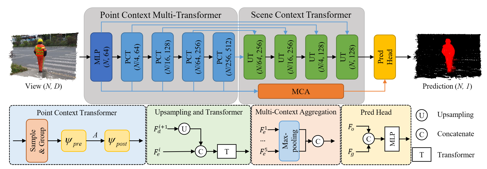

# Point Transformer-based Salient Object Detection Network for 3D Measurement Point Clouds <a name="headin"></a>

<p align="center">
     <br/>
    <em> 
Figure 1: Pipeline of PSOD-Net.
</em>
</p>

## Abstract
While salient object detection (SOD) on 2D images has been extensively studied, there is very little SOD work on 3D measurement surfaces. We propose an effective point transformer-based SOD network for 3D measurement point clouds, termed PSOD-Net. PSOD-Net is an encoder-decoder network that takes full advantage of transformers to model the contextual information in both multi-scale point- and scene-wise manners. In the encoder, we develop a Point Context Transformer (PCT) module to capture region contextual features at the point level; PCT contains two different transformers to excavate the relationship among points. In the decoder, we develop a Scene Context Transformer (SCT) module to learn context representations at the scene level; SCT contains both Upsampling-and-Transformer blocks and Multi-context Aggregation units to integrate the global semantic and multi-level features from the encoder into the global scene context. Experiments show clear improvements of PSOD-Net over its competitors and validate that PSOD-Net is more robust to challenging cases such as small objects, multiple objects, and objects with complex structures.

## dataset
You can download the PCSOD dataset from [OpenDatasets](https://git.openi.org.cn/OpenDatasets/PCSOD-Dataset/datasets) and put them under the following directory:

```
code\
├── Data\
│  ├── train\
|  └── test\
├── log\
|  ├── ptsod\
|     ├── logs\
|     └── checkpoints\
|        └── best_model.pth
├── train.py
├── test.py
└──...
```

## Running

Training
```
python train.py
```

Testing
```
python test.py

```

## Acknowledgement
Our codes are built upon [PointNet](https://github.com/yanx27/Pointnet_Pointnet2_pytorch) and [PCSOD](https://openi.pcl.ac.cn/OpenPointCloud/PCSOD). 